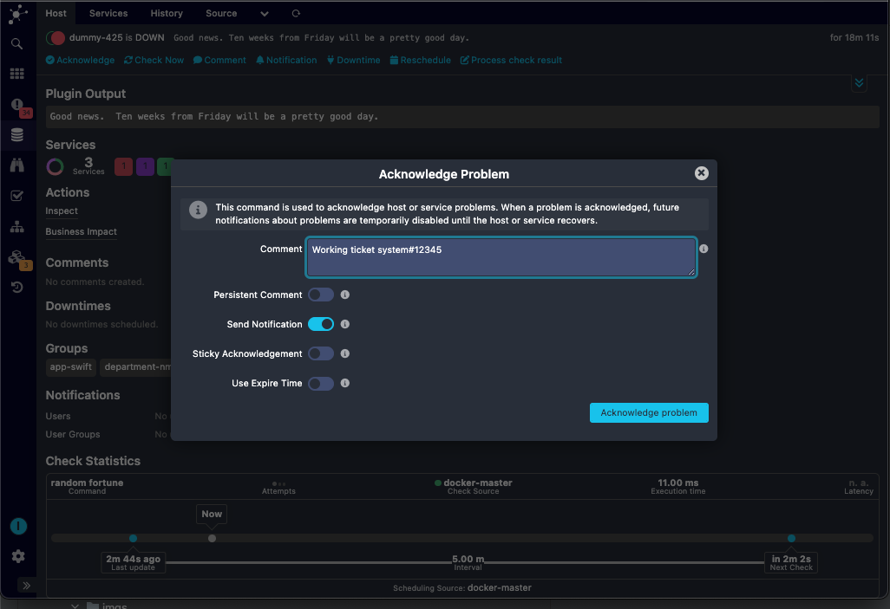
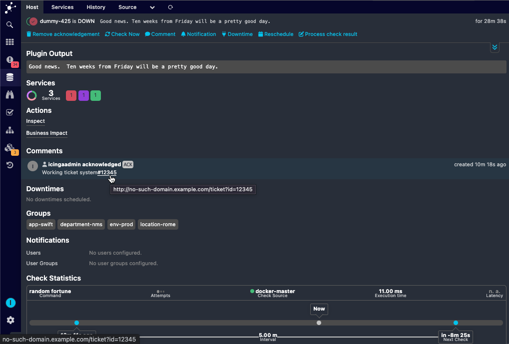
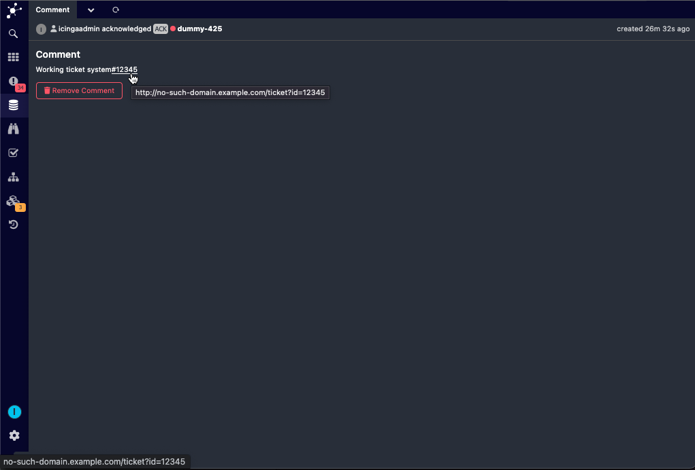

# Configuration

After you've enabled `generictts` you reach its configuration in Icinga Web via the module's configuration tab.
But you may also change its configuration manually.
`generictts` maintains a configuration file which is normally located at:

```
/etc/icingaweb2/modules/generictts/config.ini
```

You have to understand regular expressions for this configuration. A pattern
must be provided that captures the relevant value into capture group `$1`.

What happens in the following example here is that whenever we stumble over a
text containing a # followed by four to six digits, that number will be
replaced by a link pointing to that specific ticket in your TTS.

```ini
[my-ticket-system]
pattern = "/#([0-9]{4,6})/"
url = "https://my.ticket.system/tickets/id=$1"
```
## Illustration:





